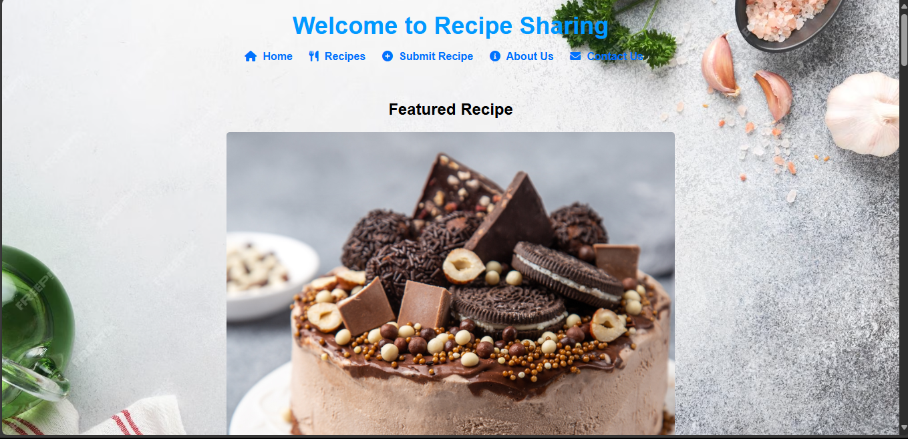

# Recipe Sharing Application

## Overview
The Recipe Sharing Application is a user-friendly web interface designed for food enthusiasts to share and discover delicious recipes. The application allows users to view featured recipes, explore various dishes, submit their own recipes, learn more about the platform, and contact the team. 

## Screenshot


## Application Domain
This application falls under the domain of **Food and Cooking**. It aims to create a community for food lovers, where they can share their culinary creations, exchange cooking tips, and inspire each other with new recipes. The platform is designed with a focus on user experience, making it easy for anyone to navigate and contribute.

## Features
- **Landing Page**: Introduces the application and highlights a featured recipe.
- **Recipes Page**: Displays a grid of recipes with images and descriptions, allowing users to explore different dishes.
- **Submit Recipe Page**: Provides a form for users to submit their own recipes, including title, description, ingredients, and an image upload option.
- **About Us Page**: Shares the mission of the platform and engages users with an image that represents the community.
- **Contact Page**: Allows users to send messages or inquiries through a contact form.

## Technologies Used
- **HTML**: For structuring the web pages.
- **CSS**: For styling and layout.
- **JavaScript**: For interactive features such as form validation and alerts.

## Getting Started
1. **Clone the Repository**:
   ```bash
   git clone https://github.com/melvinekay/WEB-II-Assignment.git
   cd your-project-folder
